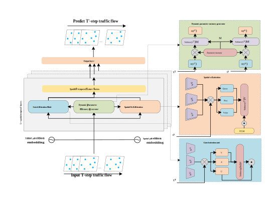

# DPSN-STHA: A Dynamic Perception Model of Similar Nodes with Spatial-Temporal Heterogeneity Attention for Traffic Flow Forecasting
<p align="center">
  
</p>


## Installation
Create a conda environment

``` 
cd DPSN-STHA
conda create --name DPSN-STHA python=3.12
conda activate DPSN-STHA
```
Install DPSN-STHA requirements

``` 
pip install -r requirements.txt
```

## Data Preparation
DPSN-STHA is implemented on those several public traffic datasets.

**PEMS03**, **PEMS04**, **PEMS07** and **PEMS08** from [STSGCN (AAAI-20)](https://github.com/Davidham3/STSGCN).
Download the data [STSGCN_data.tar.gz](https://pan.baidu.com/s/1ZPIiOM__r1TRlmY4YGlolw) with password: `p72z` and uncompress data file using`tar -zxvf data.tar.gz`

## STAM Preparation
PEMS03, PEMS04, PEMS07, PEMS08:
```
python STAM.py --config config/XXX.json
```

## Model Training
PEMS03, PEMS04, PEMS07, PEMS08:
```
python train.py --config config/XXX.json
```
## Acknowledgments
This work is supported by the ”Pioneer and Leader + X” Plan Project of
Zhejiang Province (No. 2024C01162), and the Natural Science Foundation
of Zhejiang Province (No. LRG25F030003).

